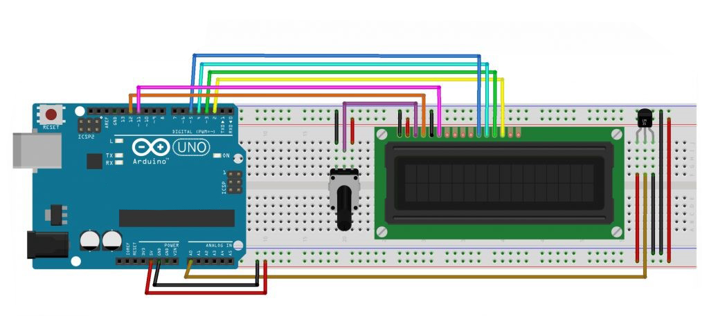

# Thermometer LM35 Based On Arduino Uno

This project is a simple thermometer using an Arduino Uno and the LM35 temperature sensor. The temperature is measured in both Celsius and Fahrenheit and displayed on a 16x2 LCD screen.

The LM35 is a linear analog temperature sensor whose output voltage varies linearly with changes in temperature. The LM35 can measure temperatures from -55 degrees Celsius to +150 degrees Celsius. The voltage output from the LM35 increases by 10 mV for every degree Celsius increase in temperature. When connected to a microcontroller, the data obtained from this sensor can be processed and displayed on a screen.

## Features

- Reads temperature data from the LM35 sensor.
- Displays temperature in Celsius and Fahrenheit on an LCD.
- Real-time temperature updates every second.

# Schematic:

- Below you can see a schematic image to facilitate the wiring of cables from the microcontroller to devices, both input and output sensors:

## Components

- Arduino Uno = 1 unit;
- LM35 Temperature Sensor = 1 unit;
- 16x2 LCD Display = 1 unit;
- • Potensiometer 10kΩ = 1 unit;
- Breadboard / ProjectBoard = 1 unit;
- Jumper wires.

## Pin Configuration

- **LM35 Sensor**:

  - Vout Sensor LM-35 (Signal) → A0  
  - Vcc → 5V  
  - GND → GND  

- **LCD Display**:
  - VSS pin on LCD → GND Arduino Uno  
  - VDD pin on LCD → 5V Arduino Uno  
  - V0 pin on LCD → Potentiometer for contrast adjustment  
  - RS pin on LCD → Pin 12 Arduino Uno  
  - R_W pin on LCD → GND Arduino Uno  
  - E pin on LCD → Pin 11 Arduino Uno  
  - DB4 pin on LCD → Pin 5 Arduino Uno  
  - DB5 pin on LCD → Pin 4 Arduino Uno  
  - DB6 pin on LCD → Pin 3 Arduino Uno  
  - DB7 pin on LCD → Pin 2 Arduino Uno  
  - A pin on LCD → 5V (Backlight) Arduino Uno  
  - K pin on LCD → GND (Backlight) Arduino Uno  

## How It Works

1. **Analog Reading**: The LM35 sensor outputs an analog voltage corresponding to the temperature. This voltage is read by the Arduino on analog pin A0.
2. **Temperature Conversion**: The voltage is converted to temperature in Celsius by calculating the millivolts and dividing by 10. The Celsius value is then converted to Fahrenheit.
3. **Display**: The temperature values in both Celsius and Fahrenheit are displayed on the 16x2 LCD screen, updating every second.

## Code Explanation

- The `LiquidCrystal` library is used to control the LCD display.
- The LM35 temperature sensor provides an analog output, which is read by the Arduino's analog pin.
- The temperature in Celsius is calculated using the formula `millivolts / 10`, and then Fahrenheit is derived using the formula `(celsius * 9) / 5 + 32`.

## Usage

1. Connect the components as per the pin configuration.
2. Upload the code to your Arduino Uno.
3. Power the Arduino, and the temperature will be displayed on the LCD in both Celsius and Fahrenheit.

## Conclusion

- This project demonstrates a simple way to create a digital thermometer using an LM35 sensor and Arduino Uno. It provides real-time temperature monitoring with an easy-to-read display.

- In this project the voltage output from the LM35 is used as input to the Arduino and the value is converted into a value in temperature units. After conversion, the results of the conversion are displayed on a 16×2 LCD screen.
"# Thermometer-LM35-BasedOn-Arduino" 
